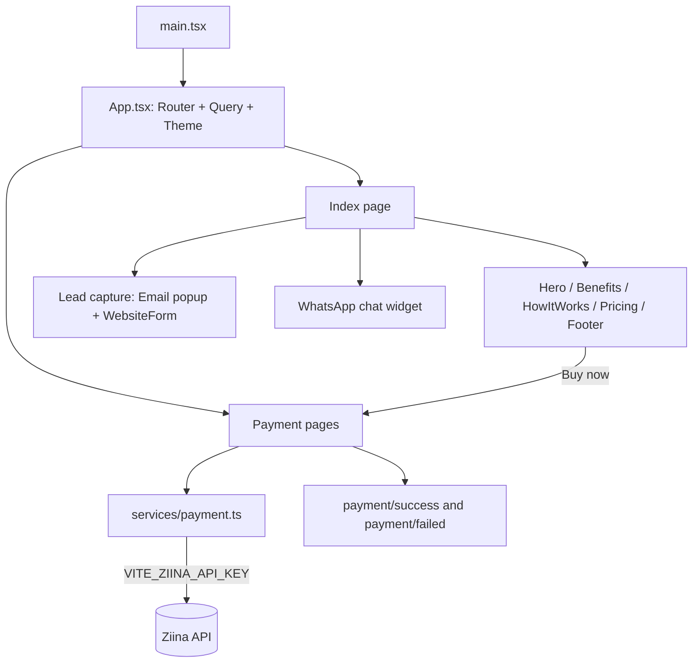

<div align="center">

# Web Development for $15 💸

### Get a website. Get *famous*. Get it for the price of two coffees.

A punchy, single-page marketing site for a no-nonsense web-development service:
one flat **$15** package, free hosting, free revisions, and a friendly WhatsApp
line to the humans behind it. Built to load fast and convert faster.

<!-- Badges -->


<br/>

<!-- Drop a screen-capture GIF at assets/demo.gif to bring this to life. -->


</div>

---

## 📑 Table of contents

- [Features](#-features)
- [Screenshots](#-screenshots)
- [Tech stack](#️-tech-stack)
- [Getting started](#-getting-started)
- [Configure payments](#-configure-payments-optional)
- [Available scripts](#-available-scripts)
- [Architecture](#-architecture)
- [Project structure](#-project-structure)
- [Live demo](#-live-demo)
- [License](#-license)

---

## ✨ Features

- **Conversion-first hero** — animated typewriter headline ("Get *Rich /
  Famous / Successful / Unstoppable*") with a dark-to-purple gradient and a
  can't-miss yellow call-to-action.
- **"What You Get" grid** — the value props at a glance, on tidy muted cards.
- **"How It Works" section** — a three-step, idea → pay → launch walkthrough
  so visitors know exactly what happens after they click.
- **Transparent pricing card** — one package, five perks, zero surprises.
- **Light / dark mode** — a one-tap theme toggle powered by `next-themes`.
- **Lead capture** — a "Limited Time Offer" email/phone popup and an inline
  website-brief form.
- **WhatsApp chat widget** — a floating "Chat with Us" bubble that deep-links
  straight to the team.
- **Ziina payment flow** — `/payment`, `/payment/success` and
  `/payment/failed` routes wired to the Ziina payment API.
- **Scroll & interaction tracking** — lightweight hooks record how far visitors
  read and what they click, so the funnel can be tuned.
- **Fully responsive** — looks sharp from a 390px phone to a widescreen
  monitor.
- **Footer with real contact routes** — WhatsApp and email, always one scroll
  away.

---

## 📸 Screenshots

| Desktop | Mobile |
| --- | --- |
|  |  |

| Hero | Footer |
| --- | --- |
|  |  |

---

## 🛠️ Tech stack

| Layer | Tools |
| --- | --- |
| **Build** | [Vite](https://vitejs.dev/) with the SWC React plugin |
| **UI** | [React 18](https://react.dev/) + **TypeScript** |
| **Styling** | [Tailwind CSS](https://tailwindcss.com/) + [shadcn/ui](https://ui.shadcn.com/) (Radix primitives) |
| **Routing** | [React Router](https://reactrouter.com/) |
| **Data & forms** | [TanStack Query](https://tanstack.com/query), [React Hook Form](https://react-hook-form.com/) + [Zod](https://zod.dev/) |
| **Motion & icons** | [GSAP](https://gsap.com/) and [lucide-react](https://lucide.dev/) |
| **Payments** | [Ziina](https://ziina.com/) payment intents |

---

## 🚀 Getting started

### Prerequisites

You'll need **[Node.js](https://nodejs.org/) 18 or newer** (which ships with
`npm`). Check what you've got:

```bash
node -v   # should print v18.x.x or higher
npm -v
```

If Node isn't installed, the easiest route is [nvm](https://github.com/nvm-sh/nvm):

```bash
nvm install 18
nvm use 18
```

### Install & run

```bash
# 1. Clone the repo
git clone https://github.com/waleedsworld/luxurious-conversion-journey-40.git
cd luxurious-conversion-journey-40

# 2. Install dependencies
npm install

# 3. Start the dev server (hot-reload on http://localhost:8080)
npm run dev
```

Open **http://localhost:8080** and you're off.

### Build for production

```bash
npm run build      # outputs to dist/
npm run preview    # serve the production build locally
```

---

## 💳 Configure payments (optional)

The pricing button kicks off a real Ziina payment intent. To wire it up, copy
the example env file and drop in your key — it's read from the environment, and
**never** committed:

```bash
cp .env.example .env.local
# then edit .env.local:
# VITE_ZIINA_API_KEY=your_real_key_here
```

Without a key the UI still runs perfectly; only the live payment call is
skipped (and it'll warn you in the console).

---

## 📜 Available scripts

| Script | What it does |
| --- | --- |
| `npm run dev` | Start the Vite dev server with hot-reload on port 8080. |
| `npm run build` | Type-check and bundle a production build into `dist/`. |
| `npm run build:dev` | Build in development mode (unminified, easier to debug). |
| `npm run preview` | Serve the production build locally for a final look. |
| `npm run lint` | Run ESLint across the project. |

---

## 🧭 Architecture

A single-page React app served by Vite. Routing is client-side; the only
external call is the Ziina payment intent, isolated behind a service module so
the marketing UI never talks to the API directly.



**How it flows**

1. `main.tsx` mounts `App.tsx`, which sets up the router, TanStack Query client
   and theme provider.
2. The **Index** page composes the marketing sections and the lead-capture and
   chat widgets.
3. Clicking **Buy now** routes to the **Payment** page, which asks
   `services/payment.ts` to create a Ziina payment intent using
   `VITE_ZIINA_API_KEY`.
4. Ziina redirects back to `/payment/success` or `/payment/failed`, each a
   dedicated result page.

---

## 📁 Project structure

```
src/
├── components/        # Hero, Benefits, HowItWorks, Pricing, Footer, chat widgets…
│   └── ui/            # shadcn/ui primitives (Radix)
├── pages/             # Index, Payment, PaymentSuccess, PaymentFailed, NotFound
├── hooks/             # scroll tracking, mobile detection, toasts
├── services/          # Ziina payment integration
├── utils/             # action handler, API config, theme preview
└── lib/               # shared helpers (cn, etc.)
```

---

## 🌐 Live demo

Live demo — deploying soon.

---

## 📄 License

Released under the MIT License. Build something great with it. 🚀
